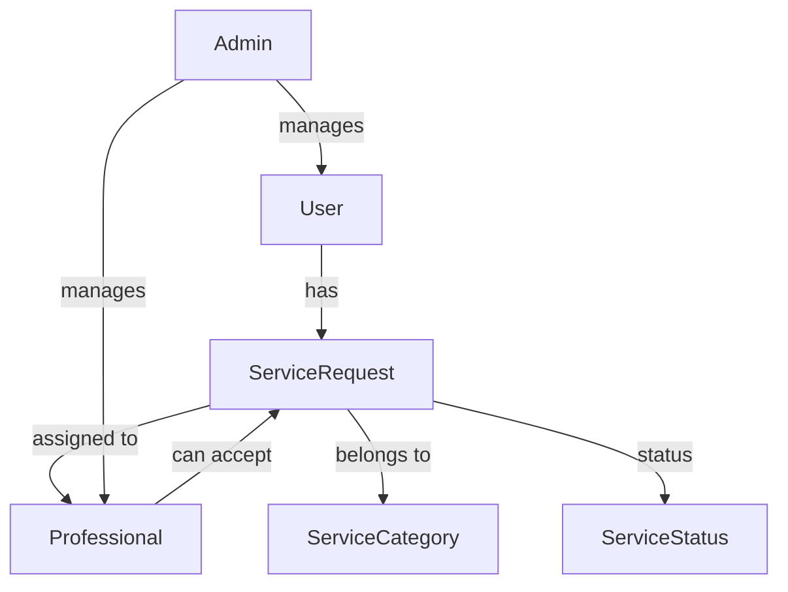

# 🌟 **A to Z Service Management App** 🌟  
### ✨ **A Robust and Scalable Service Request Management System** ✨  

---

  

Welcome to the **A to Z Service Management App**—a dynamic platform designed to efficiently **manage service requests** between **customers**, **professionals**, and **admins**. With **real-time service tracking**, **role-based dashboards**, and **secure authentication**, this app ensures smooth coordination between all users.  

---

## 💼 **Executive Summary**  

The **A to Z Service Management App** is a **monolithic**, **secure**, and **feature-rich** platform for handling household service requests. It uses **Flask**, **SQLite3**, and **Bootstrap**, prioritizing **performance**, **data security**, and **user-friendliness**.  

### 🏆 **Key Features:**  
✅ Role-based access (Customers, Professionals, Admins)  
✅ Service request creation & tracking  
✅ Professional service acceptance system  
✅ Admin dashboard for service & user management  
✅ Secure authentication using UUID-based login  

---

## 🖥️ **Technology Stack**  

### 🐍 **Backend**  
- **Flask** – Python web framework for backend development  
- **SQLite3** – Relational database engine for structured data storage  
- **Flask Core Modules**:  
   🔹 `sqlite3` – Direct database operations without an ORM  
   🔹 `render_template` – Handles Jinja2 templating  
   🔹 `request` – Captures user inputs  
   🔹 `redirect` & `url_for` – Handles URL routing  
   🔹 `send_file` & `send_from_directory` – Manages media and document sharing  

### 🎨 **Frontend**  
- **Jinja2** – Templating engine for dynamic web pages  
- **Bootstrap** – Ensures a OLD UI  

---

## 🚀 **Core Functionalities & Features**  

### 🎛️ **Administrative Capabilities:**  
- 🏗 **Service Category Management**: Create & modify service categories  
- 📊 **User Role Management**: Manage customers, professionals, and their access  
- 📋 **Real-time Service Monitoring**: View & track all service requests  
- 🔍 **Advanced Search**: Quickly filter and find users & services  

### 👥 **Customer Features:**  
- 📌 **Create Service Requests**: Request a household service  
- 📅 **Track Service Status**: Monitor request progress  
- 🔍 **Search for Professionals**: Find experts for specific services  
- 👤 **Manage Profile**: Edit personal details and request history  

### 🔧 **Professional Features:**  
- ✅ **Accept/Reject Service Requests**: Choose available services  
- 📊 **Track Job Assignments**: View accepted service requests  
- 🔍 **Filter Service Requests**: Search by category, location, or availability  

### 🔐 **Security & Authentication:**  
- 🔑 **UUID-Based Login System**: Ensures secure user authentication  
- 🛡 **Role-Based Access Control**: Prevents unauthorized data access  

---

## 💡 **Operational Workflow**  

### 🧑‍💼 **Admin Workflow:**  
1. 📂 **Create Service Categories**  
2. 🎛 **Manage Professionals & Customers**  
3. 📝 **View & Monitor All Service Requests** 

### 👨‍🎓 **Customer Workflow:**  
1. 🔐 **Login & Browse Services**  
2. 📝 **Submit a Service Request**  
3. ⏳ **Track Service Progress**  
4. 🏅 **Receive Service Completion Updates**  

### 🔧 **Professional Workflow:**  
1. 🔐 **Login & Browse Available Requests**  
2. ✅ **Accept or Reject a Request**  
3. ⏳ **Provide the Service**  
4. 🏆 **Update Job Completion Status**  

---

## 🗃️ **Database Schema**  

Here’s a **Mermaid.js diagram** of the database schema:  



---

🔗 **For more information, check the full project report:** [Project Report PDF](https://github.com/daiwik-project/House-Hold-Service/blob/main/Project%20Report.pdf)  

📺 **Watch the tutorial video:** [YouTube Video](https://youtu.be/yrqrI5WAHhI)  

---

## 🛠️ **How to Run the App**  

1. **Clone the repository:**  
   ```sh
   git clone https://github.com/daiwik-project/House-Hold-Service.git
   cd House-Hold-Service
   ```

2. **Install dependencies:**  
   ```sh
   pip install -r requirements.txt
   ```

3. **Run the Flask app:**  
   ```sh
   python app.py
   ```

4. **Access the app in your browser:**  
   ```
   http://127.0.0.1:5000
   ```

---
