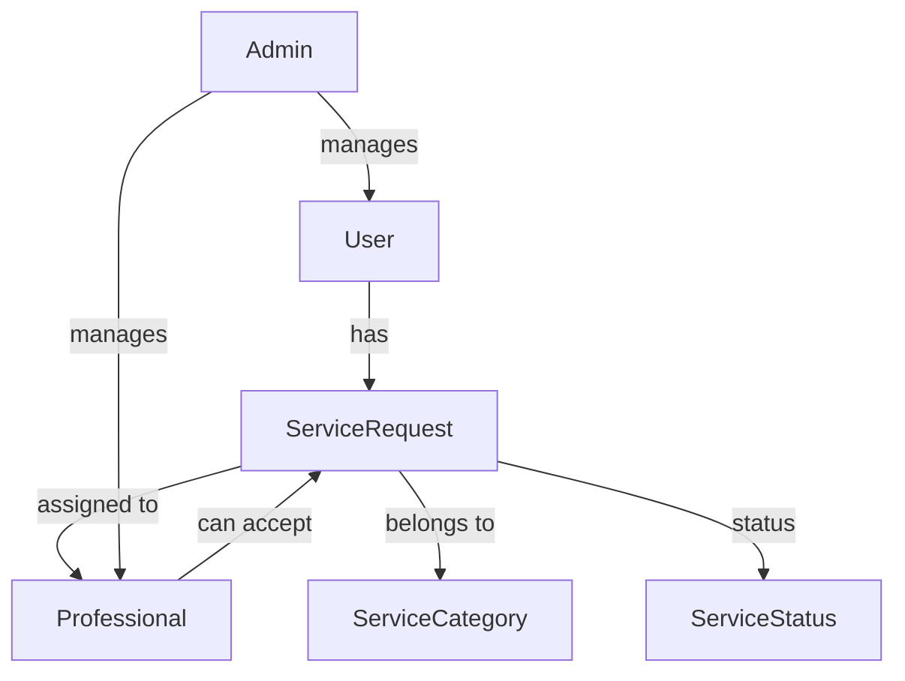

# 🌟 **A to Z Service Management App** 🌟  
### ✨ **A Simple and Secure Household Service Request System** ✨  

---

  

Welcome to the **A to Z Service Management App**—a **basic** and **secure** monolithic application built using **Flask** and **SQLite3**. It allows customers to request services, professionals to accept them, and admins to manage everything. This app is **NOT designed for scalability**, but instead prioritizes **simplicity and security** using **raw SQL commands** instead of an ORM.  

---

## 💼 **Executive Summary**  

This **monolithic** app is designed for **security-first** service request handling. It follows a **structured database approach** using **SQLite3** with **manual SQL queries**, avoiding the use of an ORM like SQLAlchemy. The **core focus** is on **data integrity**, **user role-based access**, and **ease of implementation** without complex dependencies.  

### ❌ **NOT SCALABLE!**  
This project is **NOT designed for large-scale applications**—it is built as a **simple** and **educational** Flask-SQLite3 project using **basic SQL queries**.  

---

## 🖥️ **Technology Stack**  

### 🐍 **Backend**  
- **Flask** – Python web framework for backend development  
- **SQLite3** – Lightweight relational database (without ORM)  
- **Raw SQL Queries** – All database operations use **handwritten SQL commands**, not SQLAlchemy  

### 🎨 **Frontend**  
- **Jinja2** – Server-side templating engine for HTML rendering  
- **Bootstrap** – Provides a simple responsive UI  

---

## 🚀 **Core Functionalities & Features**  

### 🎛️ **Administrative Capabilities:**  
- 🏗 **Service Category Management**: Manually add/edit service categories  
- 📊 **User Role Management**: Assign customers and professionals  
- 📋 **Real-time Service Monitoring**: Track requests via database queries  

### 👥 **Customer Features:**  
- 📌 **Create Service Requests** using simple form submission  
- 📅 **Track Service Status** manually from the user dashboard  
- 👤 **Profile Management** with basic info updates  

### 🔧 **Professional Features:**  
- ✅ **Accept/Reject Service Requests** using a **raw SQL update query**  
- 📊 **Track Assigned Services** from a simple user panel  

### 🔐 **Security & Authentication:**  
- 🔑 **UUID-Based Login System** (Custom authentication, no OAuth)  
- 🛡 **Monolithic Security Approach** – No microservices, single deployment  

---

## 💡 **Operational Workflow**  

### 🧑‍💼 **Admin Workflow:**  
1. 📂 **Manually Create Service Categories**  
2. 🎛 **Manage Professionals & Customers**  
3. 📝 **View & Monitor All Service Requests**  

### 👨‍🎓 **Customer Workflow:**  
1. 🔐 **Login & Browse Services**  
2. 📝 **Submit a Service Request**  
3. ⏳ **Track Service Progress (Manually)**  
4. 🏅 **Receive Service Completion Updates**  

### 🔧 **Professional Workflow:**  
1. 🔐 **Login & View Available Requests**  
2. ✅ **Accept or Reject Requests (Direct SQL Update)**  
3. 🏆 **Update Job Completion Status (Manual SQL Entry)**  

---

## 🗃️ **Database Schema**  

Since this app uses **RAW SQL**, here’s the **Mermaid.js representation** of its database schema:  



---

🔗 **For more information, check the full project report:** [Project Report PDF](https://github.com/daiwik-project/House-Hold-Service/blob/main/Project%20Report.pdf)  

📺 **Watch the tutorial video:** [YouTube Video](https://youtu.be/yrqrI5WAHhI)  

---

## 🛠️ **How to Run the App**  

1. **Clone the repository:**  
   ```sh
   git clone https://github.com/daiwik-project/House-Hold-Service.git
   cd House-Hold-Service
   ```

2. **Install dependencies:**  
   ```sh
   pip install -r requirements.txt
   ```

3. **Run the Flask app:**  
   ```sh
   python app.py
   ```

4. **Access the app in your browser:**  
   ```
   http://127.0.0.1:5000
   ```

---

### 🛑 **IMPORTANT DISCLAIMERS**  
⚠ **Not Scalable** – This app is meant for **learning & personal use**, not for production.  
⚠ **No ORM Used** – **All database queries are written in raw SQL**, making it easy to understand but harder to maintain.  
⚠ **Monolithic & Secure** – The app follows a **single codebase approach** for better control over security.  

---
